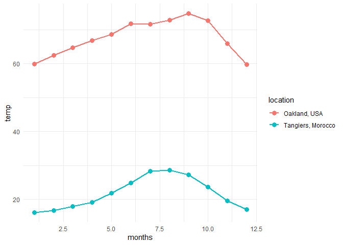
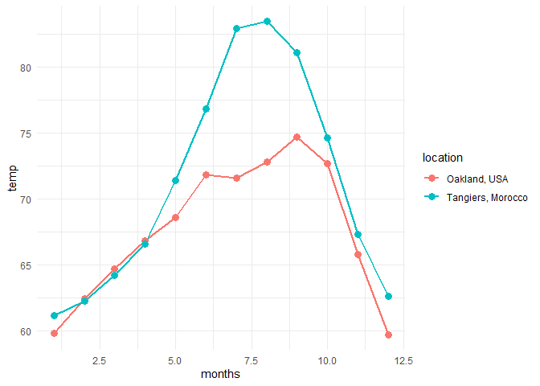

Crawling through Metadata
================
Cody Flagg
5/5/2022

    ## Warning: package 'ggplot2' was built under R version 4.0.5

# 

Imagine you want to graph the average monthly temperature between
Oakland, California and a city 6,000 miles away that is at the same
latitude (\~35 degrees). You’re full from just having a wonderful meal
at a Moroccan restaurant. Tangiers, Morocco is one such city on the east
side of the Atlantic.

**Problem**: weather stations outside of the US record temperature in
degrees Celsius versus the US’s degrees Fahrenheit.

**A Future Problem**: someone is curious about average temperatures at
35 degrees latitude across the rest of the earth in comparison to
Oakland. Each particular region or country has its own weather services
(APIs), measurement/sensor equipment, sampling frequencies etc.

How could you even begin to chart data from two different sources?

**Data Sources**

What do Oakland and Tangiers look like, on average?

[Oakland’s average annual temperature
history](https://en.wikipedia.org/wiki/Oakland,_California#Climate_and_vegetation)

[Tangiers’ average annual temperature
history](https://en.wikipedia.org/wiki/Tangier#Climate)

# Generate data

This isn’t a demo about webscraping, so we establish a 12-month annual
temperature data set from the Wikipedia sources:

``` r
# first value in HTML table is in *F
oakland_temp <- c(59.8, 62.4, 64.7, 66.8, 68.6, 71.8, 71.6, 72.8, 74.7, 72.7, 65.8, 59.7)

# first value in HTML table is in *C
tangiers_temp <- c(16.2, 16.8, 17.9, 19.2, 21.9, 24.9, 28.3, 28.6, 27.3, 23.7, 19.6, 17.0)
```

# Naive exploration

Imagine we’re eager to compare the temperature of Oakland to Tangiers,
and naively combine the two *very* similar data sets without a second
thought.

``` r
# create the x-axis to chart
months <- seq(1, 12, 1)

# create a data.frame for each city
oakland_df <- data.frame(months, 
                         temp=oakland_temp, 
                         location = 'Oakland, USA')

tangiers_df <- data.frame(months, 
                          temp=tangiers_temp, 
                          location = 'Tangiers, Morocco')

# merge the sets to display together
combined_df <- rbind(oakland_df, tangiers_df)

ggplot(data = combined_df, aes(x = months, 
                               y = temp)) + 
    geom_line(aes(color = location), size = 1) + 
    geom_point(aes(color = location), size = 3) + 
    theme_minimal()
```

<!-- -->

After charting, these two cities look VERY different despite being at
the same latitude of 35 degrees. We look at the figure and our gut tells
us that there’s no way Oakland (red) can be roughly TWICE as hot as
Tangiers, Morocco (blue)! Said another way, Tangiers doesn’t feel like a
place that would be 30 degrees Fahrenheit on average throughout the
year. What little info and experience we have suggests that Tangiers
should be warmer than Oakland throughout the year, but certainly not
cooler.

Your friend tugs on a handlebar mustache in puzzlement. There’s just no
way that Tangiers, MOROCCO can consistently be 30 degrees cooler than
Oakland. That’s crazy.

Something is amiss.

# A machine readable metadata dictionary

Now, let’s imagine there’s an organization that centralizes and stashes
global weather data along with essential metadata about those
measurements from the numerous, disparate data generating weather
networks around the world such as `source`, `measurement_type`,
`measurement units`, etc.

``` r
oakland_meta <- data.frame(source = 'Oakland, California, USA',
                           measurement_type = 'avg_daily_temp', 
                           measurement_units = 'fahrenheit',
                           measurement_freq = '5-minute',
                           sensor_type = 'Adafruit 642')

tangiers_meta <- data.frame(source = 'Tangiers, Morocco, Africa',
                           measurement_type = 'avg_daily_temp', 
                           measurement_units = 'celsius',
                           measurement_freq = '15-minute',
                           sensor_type = 'Campbell 107')
```

Think of this as a “one-dimensional” data fusion problem. The two data
sets are very similar except for the reported `measurement_units`.
Sources that ostensibly measure the same phenomena may also differ in
their `measurement_type`, sampling intervals (e.g. `measurement_freq`),
or in the equipment used (`sensor_type`). All of these variations may
introduce bias, consistency, veracity, and/or accuracy problems if
they’re merged without consideration.

# A coherent data fusion framework

What if, on top of clear definitions for a dataset, there was some
method for reading those definitions and doing something more sensible
with the different inputs?

Let’s define two functions: one function that will merge two temperature
data sets, and a function that will read metadata and adjust the outputs
to what the user wants (celsius or fahrheit):

``` r
# merging function - simple
#' @param set1 first data set to merge
#' @param set2 second data set to merge
#' @param defs1 metadata definition source for set1
#' @param defs2 metadata definition source for 
#' @param coercion what measurement unit the combined data should be converted to
#' @return a single data.frame that combines set1 and set2 inputs
fuse_weather_data <- function(set1, set2, defs1, defs2, coercion = 'Fahrenheit', ...){
    # browser()
    # because data are messy everywhere, do the minimal to standardize
    conversion = tolower(coercion)
    
    # merge metadata to inputs - super ignorant join
    data1 <- data.frame(set1, defs1)
    data2 <- data.frame(set2, defs2)
    
    # check input data and coerce if necessary
    data1 <- converter(data1, conversion = coercion)
    data2 <- converter(data2, conversion = coercion)
    
    data_join <- rbind(data1, data2)
    
    return(data_join)
    
} # function closer

## convert numeric vector from one unit to another, depending on desired type
#' @param input_df data.frame that has colum names temp and measurement_units
#' @conversion celsius or fahrenheit, the desired output units for a temperature measurement data set
#' @return a data.frame of the same dimensions as input
converter <- function(input_df, conversion = conversion, ...){

        #browser()
    
        conversion <- tolower(conversion)        

        # what are the units of the input data?
        detected_unit <- unique(input_df$measurement_units)
        
        ## perform simple conversion
        conversion_direction <- if (conversion == 'fahrenheit' & detected_unit == 'celsius'){
            # multiply input by 9/5 then add 32
            input_df$temp <- (input_df$temp * (9/5)) + 32
            input_df$measurement_units <- conversion
            return(input_df)
            
            } else if (conversion == 'celsius' & detected_unit == 'fahrenheit'){
            # multiply input by 5/9 then subtract 32
            input_df$temp <- (input_df$temp - 32)  * (5/9)
            input_df$measurement_units <- conversion
            return(input_df)
                
            } else if (conversion == detected_unit) {
                # preserve numeric inputs
                return(input_df)
            } else {
                stop('temperature conversion could not be applied')
            }
            
        } # function closer
```

# Consistent data across multiple (potentially unknown) sources

Let’s bring data together from two different cities on two different
continents after acknowledging the source measurement units.

``` r
final_output <- fuse_weather_data(oakland_df, tangiers_df, oakland_meta, tangiers_meta, coercion = 'Fahrenheit')

# try it out
corrected_chart_df <- ggplot(data = final_output, aes(x = months, 
                               y = temp)) + 
    geom_line(aes(color = location), size = 1) + 
    geom_point(aes(color = location), size = 3) + 
    theme_minimal()

corrected_chart_df
```

<!-- -->

The weather between Oakland and Tangiers is actually pretty similar
until May, when Morocco becomes much warmer. The two cities have similar
temperature profiles again starting in October.

What would someone in Tangiers think of Oakland, in terms of degrees
celsius?

# Notice the scale of the y-axis has changed

Using the same function, but selecting a different unit for the outputs.

``` r
final_output2 <- fuse_weather_data(oakland_df, tangiers_df, oakland_meta, tangiers_meta, coercion = 'Celsius')

# try it out
corrected_chart_df2 <- ggplot(data = final_output2, aes(x = months, 
                               y = temp)) + 
    geom_line(aes(color = location), size = 1) + 
    geom_point(aes(color = location), size = 3) + 
    theme_minimal()

corrected_chart_df2
```

<!-- -->

**Imagine** if there was a much larger metadata dictionary and framework
that an algorithm could reference to merge data together across data
sources that were “strangers” to one another but **that were well
defined**. A thoughtful framework would allow a naive end user to more
easily bring together data sets that might otherwise require multiple
steps in the ETL process.

## sanity tests

Quick and dirty tests of the functions working

Do the functions in concert return relevant output data?

``` r
## test the conversion function
# oaktown
# oakland_test <- data.frame(oakland_df, oakland_meta)
# tangiers_test <- data.frame(tangiers_df, tangiers_meta)

# ## manual function tests
# block <- converter(oakland_test, conversion = 'celsius'); block
# block2 <- converter(oakland_test, conversion = 'fahrenheit'); block2
# 
# block3 <- converter(tangiers_test, conversion = 'fahrenheit'); block3
# block4 <- converter(tangiers_test, conversion = 'celsius'); block4
```
